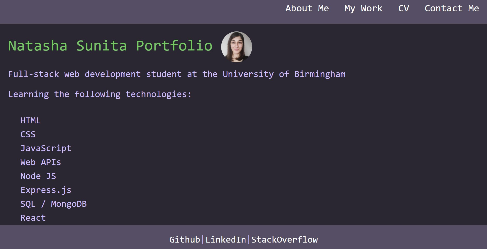

# Portfolio 

## Table of Contents

- [Description](#description)
- [Installation](#installation)
- [Usage](#usage)
- [License](#license)
- [Contributing](#contributing)
- [Tests](#tests)
- [Questions](#questions)

## Description

My professional portfolio created using React.

Deployed Application https://lonelyorphan.github.io/react-portfolio/

The portfolio contains information about the technologies I am familiar with, links to projects that I have worked on, my CV and a contact form.



## Installation

```
Download from github
```

## Usage

```
install dependencies using npm install
start the app using npm run start
```

## License

This project is licensed under MIT

## Contributing

If you would like to contribute to this project, please:

Get in touch using the contact details below

## Tests

```
There are currently no tests available for this app
```

## Questions

If you have any questions, email me at beddow90@gmail.com

GitHub: https://github.com/LonelyOrphan
